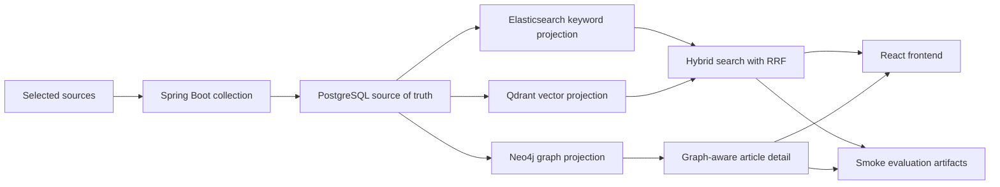

# Sigak

[English](README.md) | [한국어](README.ko.md)

Sigak은 AI, 소프트웨어 개발, 컴퓨터 과학 분야의 중요한 기술 뉴스를 선별하고 맥락을 설명하는 AI 기반 기술 뉴스 인사이트 플랫폼입니다.

v0.1 포트폴리오 MVP는 작은 end-to-end AI 검색 흐름에 집중합니다. 선택 source collection, PostgreSQL 저장, Elasticsearch keyword search, Qdrant vector search, Neo4j graph projection, hybrid retrieval, graph-aware article detail이 한 흐름으로 연결됩니다.

## 아키텍처
- `backend/`: Spring Boot 메인 백엔드와 REST API.
- `frontend/`: React + TypeScript + Vite 프론트엔드.
- `ai/`: AI/RAG 관련 기능을 담당하는 FastAPI 서비스.
- `experiments/`: retrieval과 graph-aware smoke evaluation artifact.
- `infra/`: Docker Compose와 로컬 개발 인프라.
- `docs/`: 제품 정의, 로드맵, API, 연구 전략, 현재 상태, 아키텍처 결정 기록.

Spring Boot가 public API 경계입니다. 프론트엔드는 Spring Boot를 호출하고, Spring Boot는 embedding과 향후 enrichment 같은 AI/RAG 전용 작업에만 FastAPI를 호출합니다. PostgreSQL은 source of truth이고, Elasticsearch, Qdrant, Neo4j는 재생성 가능한 projection store입니다.



## MVP 범위
- 뉴스 기사 목록
- 뉴스 기사 상세
- Elasticsearch 기반 keyword search
- FastAPI embedding boundary
- Qdrant 기반 vector search
- RRF 기반 hybrid search
- Neo4j 기반 article detail relation reason
- 선택한 기사에 대한 AI 요약
- 중요도와 why-it-matters 인사이트
- Graph RAG 준비가 가능한 기사 메타데이터
- 로컬 retrieval/graph-aware smoke report
- 단순한 프론트엔드 UI
- Docker Compose 기반 로컬 실행 환경

## 현재 상태
Sigak은 현재 v0.1 백엔드 slice와 프론트엔드 읽기 흐름이 연결된 상태입니다. 공개 article API는 API-ready PostgreSQL article만 노출하고, article detail은 related article을 bulk로 읽으며, Neo4j context가 있으면 relation reason을 표시합니다.

선별된 출처 기반 수집 파이프라인은 RSS/Atom과 arXiv 피드를 파싱하고, mock enrichment를 적용하며, 수집 항목을 중복 제거한 뒤 API에 노출 가능한 기사를 원문과 현재 enrichment 기록과 함께 저장합니다. 공개 article API는 `PUBLISHED` 상태이고 current enrichment가 있는 기사만 노출합니다.

```http
GET /api/articles
GET /api/articles?query={query}
GET /api/articles?ids={id1},{id2}
GET /api/articles/{id}
GET /api/articles/{id}/graph-context
```

공개 검색은 non-blank query에 대해 Elasticsearch keyword 후보와 Qdrant vector 후보를 reciprocal rank fusion으로 결합하고, 최종 응답은 PostgreSQL에서 다시 읽습니다. 한쪽 projection path가 실패하면 keyword-only 또는 vector-only로 degrade하고, 두 path가 모두 실패하면 PostgreSQL field filtering으로 fallback합니다. Neo4j는 article-topic, article-article graph context를 재생성 가능한 projection으로 저장해 상세 화면의 relation reason에 사용합니다.

현재 evaluation artifact는 의도적으로 smoke 규모입니다. 커밋된 retrieval comparison과 graph-aware evaluation은 보존된 `api-ready-2026-06-02` catalog와 3개 reviewed query를 사용합니다. `experiments/datasets/raw/articles.catalog.api-ready-2026-06-05.json`에는 41개 article catalog가 있지만, 이 catalog의 reviewed label이 아직 없으므로 expanded benchmark 품질 주장은 보류합니다.

## 로컬 실행
저장소 루트에서 PostgreSQL, 검색 인프라, graph 인프라, AI 서버를 실행합니다.

```bash
docker compose -f infra/docker-compose.yml up -d --pull never postgres elasticsearch qdrant neo4j ai
```

백엔드를 실행합니다.

```bash
cd backend
./gradlew bootRun
```

백엔드가 실행된 뒤 다른 터미널에서 projection을 rebuild합니다.

```bash
curl -X POST http://localhost:8080/api/internal/search-projections/articles/rebuild
curl -X POST http://localhost:8080/api/internal/search-projections/article-vectors/rebuild
curl -X POST http://localhost:8080/api/internal/graph-projections/articles/rebuild
```

Public search와 graph context를 확인합니다.

```bash
curl "http://localhost:8080/api/articles?query=graph"
curl http://localhost:8080/api/articles/4/graph-context
curl http://localhost:8080/api/internal/search-metrics/articles
```

다른 터미널에서 프론트엔드를 실행합니다.

```bash
cd frontend
npm install
npm run dev
```

로컬 URL:

```txt
http://localhost:5173
http://localhost:8080/swagger-ui/index.html
http://localhost:8080/api/articles
```

전체 재현 가능한 백엔드 데모는 [로컬 데모 흐름](docs/DEMO_FLOW.ko.md)을 참고합니다.

## Evaluation Artifact
Smoke artifact는 evaluation pipeline의 재현성을 보여주기 위한 것이며, 최종 검색 품질 주장이 아닙니다.

```bash
node -e "const s=require('./experiments/results/retrieval/latest/metrics.comparison.json'); console.log(JSON.stringify({catalogId:s.catalogId,evaluatedQueryCount:s.evaluatedQueryCount,systems:s.systems.map((system)=>system.system),warnings:s.warnings}, null, 2))"
node -e "const s=require('./experiments/results/graph/latest/graph-context.metrics.summary.json'); console.log(JSON.stringify({catalogId:s.catalogId,evaluatedQueryCount:s.evaluatedQueryCount,macroGraphContextCoverageAtK:s.macroGraphContextCoverageAtK,warnings:s.warnings}, null, 2))"
```

기대 신호:

- `catalogId`는 `api-ready-2026-06-02`다.
- `evaluatedQueryCount`는 `3`이다.
- warning은 artifact가 smoke-only라는 점을 명시한다.
- 41개 article expanded benchmark 결과는 `api-ready-2026-06-05` label이 reviewed 되기 전까지 주장하지 않는다.

## 프로젝트 구조
```txt
sigak/
├── ai/
├── backend/
├── docs/
│   ├── PRODUCT.md
│   ├── ROADMAP.md
│   ├── STATUS.md
│   ├── RESEARCH_STRATEGY.md
│   ├── DEMO_FLOW.md
│   ├── ko/
│   └── decisions/
├── experiments/
├── frontend/
├── infra/
│   └── docker-compose.yml
├── AGENTS.md
├── README.md
└── .env.example
```

## 문서
- [문서 인덱스](docs/README.ko.md)
- [제품 정의](docs/PRODUCT.ko.md)
- [로드맵](docs/ROADMAP.ko.md)
- [현재 상태](docs/STATUS.ko.md)
- [로컬 데모 흐름](docs/DEMO_FLOW.ko.md)
- [연구 전략](docs/RESEARCH_STRATEGY.ko.md)
- [API 명세](docs/API_SPEC.ko.md)
- [출처 정책](docs/SOURCE_POLICY.ko.md)
- [한국어 가이드](docs/ko/GUIDE.md)
- [초기 아키텍처 ADR](docs/decisions/0001-initial-architecture.ko.md)
- [제품 범위와 Graph RAG 전략 ADR](docs/decisions/0002-product-scope-and-graph-rag-strategy.ko.md)
