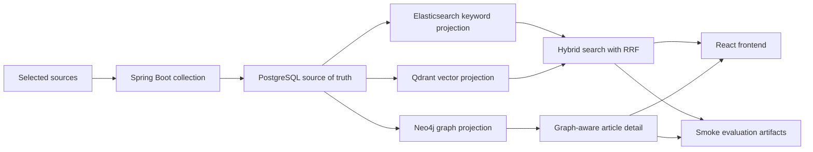

# Sigak

[English](README.md) | [한국어](README.ko.md)

Sigak is an AI-powered technical news insight platform for AI, software development, and computer science.

The v0.1 portfolio MVP focuses on a small but complete AI search flow: selected-source collection, PostgreSQL persistence, Elasticsearch keyword search, Qdrant vector search, Neo4j graph projection, hybrid retrieval, and graph-aware article detail.

## Architecture
- `backend/`: Spring Boot main backend and REST API.
- `frontend/`: React + TypeScript + Vite frontend.
- `ai/`: FastAPI service for AI/RAG-related capabilities.
- `experiments/`: retrieval and graph-aware smoke evaluation artifacts.
- `infra/`: Docker Compose and local development infrastructure.
- `docs/`: product, roadmap, API, research strategy, status, and architecture decisions.

Spring Boot is the public API boundary. The frontend calls Spring Boot, and Spring Boot calls FastAPI only for AI/RAG-specific work such as embeddings and future enrichment. PostgreSQL is the source of truth; Elasticsearch, Qdrant, and Neo4j are rebuildable projection stores.



## MVP Scope
- News article list
- News article detail
- Elasticsearch-backed keyword search
- FastAPI-backed embedding boundary
- Qdrant-backed vector search
- RRF-based hybrid search
- Neo4j-backed relation reasons on article detail
- AI summary for selected articles
- Importance and why-it-matters insight
- Graph RAG-ready article metadata
- Local retrieval and graph-aware smoke reports
- Simple frontend UI
- Docker Compose local setup

## Current Status
Sigak now has a connected v0.1 backend slice and a frontend reading flow. Public article APIs expose API-ready PostgreSQL articles only, article detail loads related articles in bulk, and the frontend displays graph relation reasons when Neo4j context is available.

The selected-source collection pipeline now parses RSS/Atom and arXiv feeds, applies mock enrichment, deduplicates collected items, and persists API-ready articles with raw content and current enrichment records. Public article APIs expose only published articles that have current enrichment.

```http
GET /api/articles
GET /api/articles?query={query}
GET /api/articles?ids={id1},{id2}
GET /api/articles/{id}
GET /api/articles/{id}/graph-context
```

Public search uses Elasticsearch keyword candidates and Qdrant vector candidates for non-blank queries, fuses them with reciprocal rank fusion, and reloads final responses from PostgreSQL. If one projection path fails, search degrades to keyword-only or vector-only; if both fail, it falls back to PostgreSQL field filtering. Neo4j stores rebuildable article-topic and article-article graph context for relation reasons on detail pages.

The current evaluation artifacts are intentionally smoke-sized. The latest committed retrieval comparison and graph-aware evaluation use the preserved `api-ready-2026-06-02` catalog with 3 reviewed queries. A larger 41-article catalog exists at `experiments/datasets/raw/articles.catalog.api-ready-2026-06-05.json`, but expanded benchmark claims are deferred until reviewed labels exist for that catalog.

## Run Locally
From the repository root, start PostgreSQL, search infrastructure, graph infrastructure, and the AI server:

```bash
docker compose -f infra/docker-compose.yml up -d --pull never postgres elasticsearch qdrant neo4j ai
```

Start the backend:

```bash
cd backend
./gradlew bootRun
```

After the backend starts, rebuild the projections from another terminal:

```bash
curl -X POST http://localhost:8080/api/internal/search-projections/articles/rebuild
curl -X POST http://localhost:8080/api/internal/search-projections/article-vectors/rebuild
curl -X POST http://localhost:8080/api/internal/graph-projections/articles/rebuild
```

Run public search and graph context checks:

```bash
curl "http://localhost:8080/api/articles?query=graph"
curl http://localhost:8080/api/articles/4/graph-context
curl http://localhost:8080/api/internal/search-metrics/articles
```

Start the frontend in another terminal:

```bash
cd frontend
npm install
npm run dev
```

Local URLs:

```txt
http://localhost:5173
http://localhost:8080/swagger-ui/index.html
http://localhost:8080/api/articles
```

For the full reproducible backend demo, follow [Local Demo Flow](docs/DEMO_FLOW.md).

## Evaluation Artifacts
Smoke artifacts are committed to show that the evaluation pipeline is reproducible, not to claim final search quality.

```bash
node -e "const s=require('./experiments/results/retrieval/latest/metrics.comparison.json'); console.log(JSON.stringify({catalogId:s.catalogId,evaluatedQueryCount:s.evaluatedQueryCount,systems:s.systems.map((system)=>system.system),warnings:s.warnings}, null, 2))"
node -e "const s=require('./experiments/results/graph/latest/graph-context.metrics.summary.json'); console.log(JSON.stringify({catalogId:s.catalogId,evaluatedQueryCount:s.evaluatedQueryCount,macroGraphContextCoverageAtK:s.macroGraphContextCoverageAtK,warnings:s.warnings}, null, 2))"
```

Expected signal:

- `catalogId` is `api-ready-2026-06-02`.
- `evaluatedQueryCount` is `3`.
- warnings explicitly mark the artifacts as smoke-only.
- expanded 41-article benchmark results are not claimed until `api-ready-2026-06-05` labels are reviewed.

## Project Structure
```txt
sigak/
├── ai/
├── backend/
├── docs/
│   ├── PRODUCT.md
│   ├── ROADMAP.md
│   ├── STATUS.md
│   ├── RESEARCH_STRATEGY.md
│   ├── DEMO_FLOW.md
│   ├── ko/
│   └── decisions/
├── experiments/
├── frontend/
├── infra/
│   └── docker-compose.yml
├── AGENTS.md
├── README.md
└── .env.example
```

## Documentation
- [Documentation Index](docs/README.md)
- [Product](docs/PRODUCT.md)
- [Roadmap](docs/ROADMAP.md)
- [Status](docs/STATUS.md)
- [Local Demo Flow](docs/DEMO_FLOW.md)
- [Research Strategy](docs/RESEARCH_STRATEGY.md)
- [API Spec](docs/API_SPEC.md)
- [Source Policy](docs/SOURCE_POLICY.md)
- [Korean Guide](docs/ko/GUIDE.md)
- [Initial Architecture ADR](docs/decisions/0001-initial-architecture.md)
- [Product Scope and Graph RAG Strategy ADR](docs/decisions/0002-product-scope-and-graph-rag-strategy.md)
