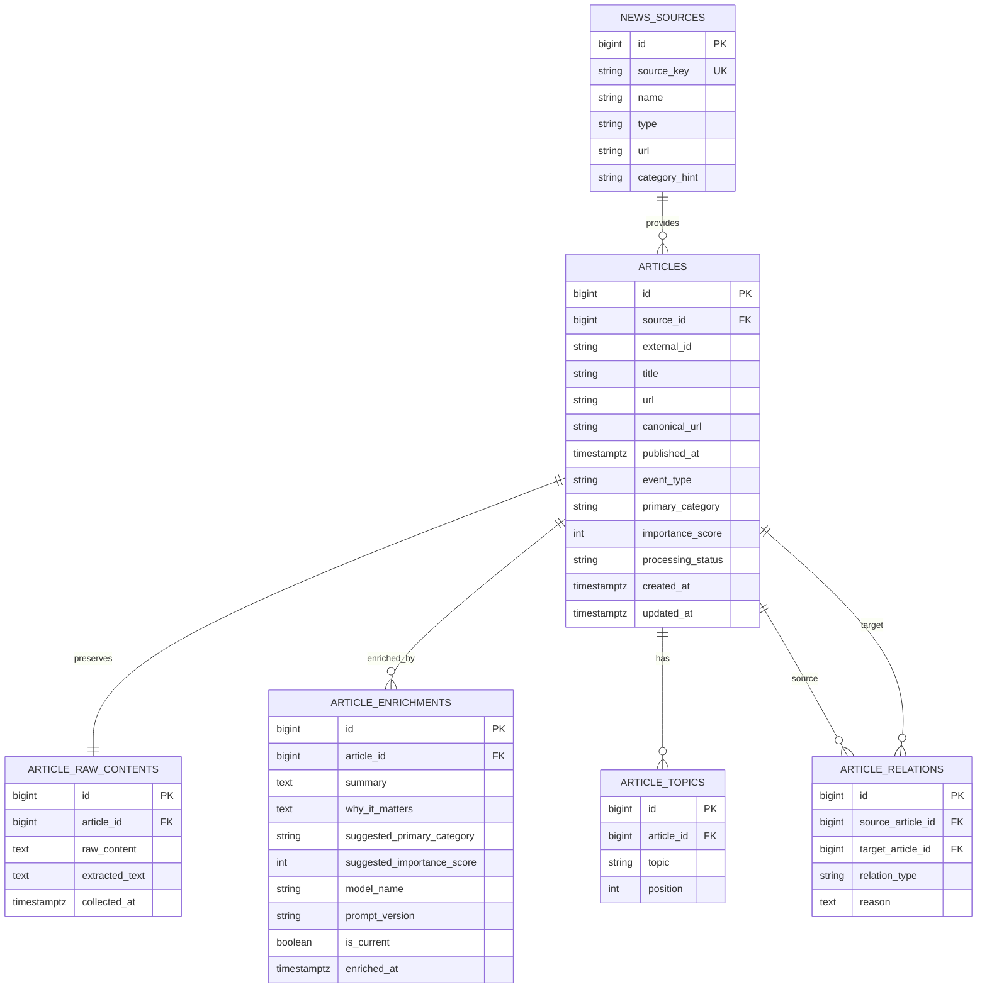

# Phase 6 Persistence MVP Design

## Summary

Phase 6 replaces the backend's in-memory mock article list with PostgreSQL-backed persistence while keeping the public article API stable.

The implementation will use:

- PostgreSQL for local persistence
- Docker Compose for local database setup
- Flyway SQL migrations for schema and seed data
- Spring Data JPA repositories and service-level DTO mapping
- A relational article model that preserves raw source text and AI enrichment separately

The goal is to make Sigak's article data model visible, reviewable, and ready for later Graph RAG work without implementing the full graph model in this phase.

## Goals

- Keep the existing article API contract stable:
  - `GET /api/articles`
  - `GET /api/articles?query={query}`
  - `GET /api/articles/{id}`
- Move the current five curated mock articles into PostgreSQL seed data.
- Add JPA entities, repositories, and service logic for persisted articles.
- Preserve raw collected article content separately from AI enrichment output.
- Store topics and related articles as relational data instead of embedded mock arrays.
- Use Flyway so database schema changes are explicit and reviewable.
- Keep the implementation small enough for a focused MVP persistence milestone.

## Non-Goals

- Do not add Elasticsearch-backed keyword search in Phase 6.
- Do not add Qdrant or embeddings in Phase 6.
- Do not implement full Graph RAG schema yet.
- Do not add user accounts, saved articles, admin workflows, or personalization.
- Do not change the frontend API response shape.
- Do not introduce cloud-specific database dependencies.

## Architecture

Spring Boot remains the main backend and API boundary. The frontend continues to call Spring Boot, and Spring Boot reads article data from PostgreSQL through JPA repositories.

```txt
ArticleController
-> ArticleService
-> ArticleRepository / relation queries
-> JPA entities
-> ArticleResponse DTO
```

The collection domain models from Phase 5 remain separate from persistence entities. `CollectedArticle`, `NewsSource`, and `ArticleEnrichment` continue to represent collection and enrichment pipeline data. Database models use `Entity` suffixes where needed to avoid confusion.

## Data Model

Phase 6 uses a relational MVP model centered on `articles`.

```txt
news_sources
articles
article_raw_contents
article_enrichments
article_topics
article_relations
```

### `news_sources`

Stores curated source metadata.

```txt
id bigint primary key
source_key varchar unique not null
name varchar not null
type varchar not null
url text not null
category_hint varchar
```

`source_key` preserves readable identifiers such as `openai-blog` and `arxiv-cs-ai`. Numeric `id` values are used for database relationships.

### `articles`

Stores article identity, classification, ranking, and source linkage.

```txt
id bigint primary key
source_id bigint not null references news_sources(id)
external_id varchar
title varchar not null
url text not null
canonical_url text not null
published_at timestamptz not null
event_type varchar not null
primary_category varchar not null
importance_score integer not null
processing_status varchar not null
created_at timestamptz not null
updated_at timestamptz not null
```

The article URL should be unique enough for MVP seed data. Duplicate-detection rules using canonical URL, external source IDs, title, source, and publication date are deferred to Phase 7.

### `article_raw_contents`

Stores original and extracted text separately from article list metadata.

```txt
id bigint primary key
article_id bigint unique not null references articles(id)
raw_content text not null
extracted_text text not null
collected_at timestamptz not null
```

The one-to-one shape is enough for Phase 6 because each saved article has one current preserved source snapshot. If later collection needs historical snapshots, this can become one-to-many without changing the public article API.

### `article_enrichments`

Stores AI or curated enrichment output separately from raw source content.

```txt
id bigint primary key
article_id bigint not null references articles(id)
summary text not null
why_it_matters text not null
suggested_primary_category varchar
suggested_importance_score integer
model_name varchar not null
prompt_version varchar not null
is_current boolean not null
enriched_at timestamptz not null
```

This is a one-to-many relationship so the project can keep enrichment history when prompts or models change. The public API uses the enrichment row where `is_current = true`.

The migration should enforce at most one current enrichment per article. In PostgreSQL, this can be represented with a partial unique index on `(article_id)` where `is_current = true`.

### `article_topics`

Stores the current string topics from the API as relational rows.

```txt
id bigint primary key
article_id bigint not null references articles(id)
topic varchar not null
position integer not null
```

`position` preserves API response order and keeps tests stable. Concepts and graph nodes remain Phase 8 work.

### `article_relations`

Stores related-article links currently represented by `relatedArticleIds`.

```txt
id bigint primary key
source_article_id bigint not null references articles(id)
target_article_id bigint not null references articles(id)
relation_type varchar not null
reason text
```

`reason` is optional in Phase 6 seed data but leaves room for later relationship explanations. Phase 8 can expand this into explicit concepts and richer evidence.

## Constraints and Indexes

The first migration should include practical constraints without overbuilding:

- unique source keys in `news_sources`
- unique article URLs in `articles` for MVP seed data
- one raw-content row per article
- at most one current enrichment per article
- unique topic positions per article
- unique relation pairs per relation type
- indexes on article source, publication time, importance score, topic text, and relation endpoints

Foreign key deletes should be conservative. Deleting an article may cascade to raw content, enrichments, topics, and relation rows, but deleting a news source should be restricted while articles still reference it.

## Mermaid ERD



## Backend Package Shape

The implementation should keep controllers thin and business logic in services.

```txt
com.sigak.article.domain
- ArticleEntity
- ArticleRawContentEntity
- ArticleEnrichmentEntity
- ArticleTopicEntity
- ArticleRelationEntity
- EventType
- PrimaryCategory
- ProcessingStatus
- RelationType

com.sigak.source.domain
- NewsSourceEntity

com.sigak.article.repository
- ArticleRepository
- ArticleRelationRepository

com.sigak.article.service
- ArticleService
```

The exact repository split can be adjusted during implementation if Spring Data projections or entity graph queries make a simpler structure clearer.

## API Data Flow

`GET /api/articles` reads articles from PostgreSQL and maps them to the existing `ArticleResponse`.

The response is assembled from:

- `articles`
- `news_sources.name`
- current `article_enrichments`
- `article_topics` ordered by `position`
- outgoing `article_relations.target_article_id`

Default listing order:

```txt
importance_score desc
published_at desc
id asc
```

Search behavior remains compatible with the current API:

- trim leading and trailing whitespace
- if query is blank, return the default list
- case-insensitive contains matching over:
  - article title
  - current summary
  - primary category
  - topic

The persistence implementation may use a JPQL query or a service-level filtering approach for the first small dataset. If service-level filtering is used initially, the public behavior must still match current tests and docs.

## Configuration

Backend dependencies:

- `spring-boot-starter-data-jpa`
- PostgreSQL JDBC driver
- Flyway
- Testcontainers for PostgreSQL-backed integration tests

Local infrastructure:

- Add a `postgres` service to `infra/docker-compose.yml`
- Use explicit development credentials from committed local examples only
- Do not commit `.env` or real secrets

Application configuration:

- Add datasource, JPA, and Flyway settings under backend resources
- Prefer environment-variable overrides for username, password, host, port, and database name
- Keep SQL schema management under Flyway, not Hibernate `ddl-auto`

## Testing

Minimum expected test coverage:

- `ArticleServiceTest`
  - returns persisted articles when query is absent
  - supports title search
  - supports summary search
  - supports primary category search
  - supports topic search
  - returns a detail article by id
  - returns null for unknown ids
- `ArticleControllerTest`
  - preserves the existing response shape
  - preserves query behavior
  - returns `404 Not Found` for unknown ids
- Persistence integration test
  - runs Flyway migrations against PostgreSQL through Testcontainers
  - verifies seed data includes the five existing MVP articles

Existing frontend tests should not require changes because the public article response remains stable.

## Documentation Updates

Implementation should update:

- `README.md` with PostgreSQL local run notes
- `backend/README.md` with backend database setup
- `infra/README.md` with Docker Compose PostgreSQL usage
- `docs/API_SPEC.md` with persistence notes while keeping API shape unchanged
- `docs/ROADMAP.md` Phase 6 checkboxes
- `docs/decisions/0004-persistence-mvp.md` to record the persistence decision

## Trade-Offs

This design is more complex than a single `articles` table, but it makes raw content, enrichment output, topics, and relationships visible in the database. That is important for a portfolio-grade backend and future Graph RAG work.

It is smaller than implementing `concepts`, `article_concepts`, and `concept_relations` immediately. That keeps Phase 6 focused on persistence while leaving Phase 8 room to introduce explicit graph data when the product is ready for relationship-aware insight generation.

Testcontainers adds some local test cost, but it verifies PostgreSQL and Flyway behavior more honestly than H2. That is the better fit because Phase 6 is specifically about a real relational database.

## Acceptance Criteria

- Local PostgreSQL can be started with Docker Compose.
- Backend starts against PostgreSQL with Flyway migrations applied.
- The article list and detail APIs return the same response shape as before.
- The five current curated articles are loaded from database seed data, not an in-memory list.
- Keyword search behavior remains compatible with current API docs.
- Service, controller, and persistence integration tests pass.
- Documentation explains how to run the persistence-backed backend locally.
