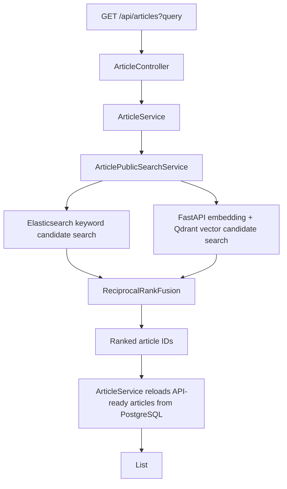

# Hybrid Article Search Design

## Summary

Public article search will move from keyword-only search to hybrid search.
`GET /api/articles?query=...` will combine Elasticsearch keyword candidates and Qdrant vector candidates, fuse them with reciprocal rank fusion, and still return the existing `List<ArticleResponse>` shape.

PostgreSQL remains the source of truth for public article responses. Elasticsearch and Qdrant remain rebuildable projection stores used only for candidate generation.

## Current State

- Blank `GET /api/articles` returns API-ready articles from PostgreSQL.
- Non-blank `GET /api/articles?query=...` uses Elasticsearch first.
- If Elasticsearch fails, the backend falls back to PostgreSQL field filtering.
- Qdrant vector projection rebuild is available through an internal endpoint.
- Internal Qdrant vector search can embed a query, search Qdrant, reload articles from PostgreSQL, and expose vector metrics.
- Public article search is not yet connected to Qdrant or hybrid ranking.

## Design Goal

Make public article search hybrid by default while keeping the public response stable and the API resilient when search infrastructure is partially unavailable.

The user-facing contract stays:

```http
GET /api/articles?query=graph rag
```

```json
[
  {
    "id": 4,
    "title": "New Research Maps Failure Modes in Graph RAG Systems",
    "source": "Example Source",
    "url": "https://example.com/articles/graph-rag",
    "publishedAt": "2026-05-04T09:10:00Z",
    "eventType": "RESEARCH",
    "primaryCategory": "CS_RESEARCH",
    "topics": ["graph rag", "retrieval"],
    "summary": "Article summary",
    "whyItMatters": "Article insight",
    "importanceScore": 88,
    "relatedArticleIds": [1, 3]
  }
]
```

No search scores, embedding metadata, or timing metadata will be added to the public article response.

## Final Architecture

### Main Flow



`ArticleService` remains responsible for loading public API responses from PostgreSQL. The new public search service is responsible only for retrieval decisions and ranked article IDs.

### Important Boundary

The existing `ArticleVectorSearchService` must not be called directly from `ArticleService`.

Current dependency direction:

```text
ArticleVectorSearchService -> ArticleService
```

If public search were implemented as:

```text
ArticleService -> ArticleVectorSearchService -> ArticleService
```

the backend would create a circular dependency and mix public search orchestration with internal vector diagnostics.

To avoid this, vector candidate generation should be extracted into a lower-level service:

```text
ArticleVectorCandidateSearchService
```

Responsibilities:

- Trim and validate the query for vector candidate search.
- Call `EmbeddingClient`.
- Search `ArticleVectorProjectionIndexer`.
- Return ranked article IDs and vector timing metadata.
- Not reload `ArticleResponse`.
- Not depend on `ArticleService`.

Then:

- `ArticlePublicSearchService` uses keyword and vector candidate services.
- `ArticleVectorSearchService` can reuse the same vector candidate service for the internal endpoint, then reload articles through `ArticleService` as it does today.
- `ArticleService` calls `ArticlePublicSearchService`, then reloads final articles from PostgreSQL.

## Ranking Design

Hybrid ranking will use reciprocal rank fusion.

Formula:

```text
rrf_score(article) = sum(weight(channel) / (rrf_k + rank_in_channel))
```

Initial settings:

- `rrf_k`: `60`
- keyword weight: `1.0`
- vector weight: `1.0`
- keyword candidate limit: `20`
- vector candidate limit: `20`
- final public search result limit: `20`

Ranks are 1-based. If an article appears in both channels, its fused score increases. If an article appears in only one channel, it can still be returned.

Tie-breakers:

1. Higher fused score
2. Higher best individual channel rank
3. Lower article ID for deterministic ordering

Raw Elasticsearch scores and Qdrant scores will not be mixed directly because they are not calibrated on the same scale. RRF uses rank positions instead, which is simpler and more robust for the MVP.

## Fallback Design

Hybrid search has multiple dependencies:

- Elasticsearch
- FastAPI embedding endpoint
- Qdrant
- PostgreSQL

The public API should not fail just because one projection store is temporarily unavailable.

Fallback rules:

| Situation | Public behavior | Recorded mode |
| --- | --- | --- |
| Elasticsearch and vector search both succeed | Fuse keyword and vector candidates | `HYBRID` |
| Vector path fails, Elasticsearch succeeds | Return keyword candidate results | `KEYWORD_ONLY` |
| Elasticsearch fails, vector path succeeds | Return vector candidate results | `VECTOR_ONLY` |
| Elasticsearch and vector path both fail | Use PostgreSQL field filtering | `POSTGRES_FALLBACK` |
| Both search paths succeed with no candidates | Return empty list | `HYBRID` |
| One search path fails and the other succeeds with no candidates | Return empty list from the successful path | `KEYWORD_ONLY` or `VECTOR_ONLY` |

An empty candidate list is not treated as infrastructure failure. It can be a valid search result.

PostgreSQL fallback is reserved for the case where no projection-backed retrieval path is available. This keeps behavior predictable and prevents valid zero-result searches from being hidden by a broad database scan.

## Metrics Design

The existing internal article search metrics should be extended from keyword-only metrics to public search metrics.

Public responses will not include metrics. Metrics remain available through:

```http
GET /api/internal/search-metrics/articles
```

Each search observation should record:

- `queryLength`
- `resultCount`
- `mode`: `HYBRID`, `KEYWORD_ONLY`, `VECTOR_ONLY`, or `POSTGRES_FALLBACK`
- `keywordCandidateCount`
- `vectorCandidateCount`
- `fusedCandidateCount`
- `staleCandidateCount`
- `keywordFailed`
- `vectorFailed`
- `fallbackReason`
- `keywordElapsedMs`
- `embeddingElapsedMs`
- `vectorElapsedMs`
- `fusionElapsedMs`
- `articleReloadElapsedMs`
- `totalElapsedMs`

The original query text must not be stored in metrics. Query length is enough for local observability and avoids capturing user search text.

Summary metrics should include:

- total search count
- hybrid search count
- keyword-only search count
- vector-only search count
- PostgreSQL fallback search count
- fallback rate
- average total latency
- p50 total latency
- p95 total latency
- last search snapshot

This gives enough evidence for local smoke tests, performance notes, and future blog posts without introducing a production observability stack.

## Configuration

Add hybrid search settings under `sigak.search`.

```yaml
sigak:
  search:
    mode: ${SIGAK_SEARCH_MODE:hybrid}
    hybrid:
      rrf-k: ${SIGAK_HYBRID_RRF_K:60}
      keyword-weight: ${SIGAK_HYBRID_KEYWORD_WEIGHT:1.0}
      vector-weight: ${SIGAK_HYBRID_VECTOR_WEIGHT:1.0}
      keyword-candidate-limit: ${SIGAK_HYBRID_KEYWORD_CANDIDATE_LIMIT:20}
      vector-candidate-limit: ${SIGAK_HYBRID_VECTOR_CANDIDATE_LIMIT:20}
      result-limit: ${SIGAK_HYBRID_RESULT_LIMIT:20}
```

Supported modes:

- `hybrid`: default public search mode
- `keyword`: use Elasticsearch with PostgreSQL fallback, matching the current behavior

No public request parameter will be added for selecting search mode. Search mode is an operational configuration, not part of the user API contract.

## Error Handling

Keyword search failures:

- Catch runtime failures from Elasticsearch keyword search.
- Mark keyword path as failed.
- Continue with vector path if available.

Vector search failures:

- Catch runtime failures from embedding or Qdrant.
- Mark vector path as failed.
- Continue with keyword path if available.

Both projection paths failed:

- Use existing PostgreSQL field filtering.
- Record `POSTGRES_FALLBACK`.
- Log the failure reason without storing the raw query.

Stale candidates:

- If Elasticsearch or Qdrant returns IDs that are no longer API-ready, PostgreSQL reload omits them.
- Metrics record `staleCandidateCount`.
- Public API still returns the remaining valid articles.

## Known Problems And Improvements From Review

### Problem: Circular Dependency Risk

Calling the current internal vector search service from public article search would create a circular dependency. The design fixes this by extracting vector candidate generation below both public hybrid search and internal vector diagnostics.

### Problem: Score Calibration

Elasticsearch `_score` and Qdrant cosine scores are not directly comparable. The design avoids direct score mixing and uses RRF rank fusion.

### Problem: Partial Infrastructure Failure

Hybrid search adds more moving parts than keyword-only search. The design treats Elasticsearch and vector search as independent candidate channels so one failed channel does not break the public API.

### Problem: Internal Metrics Compatibility

The existing article search metrics are keyword-centric. Hybrid search needs mode-aware metrics. Since the endpoint is internal and MVP-local, extending the response is acceptable. Documentation and tests must be updated together.

### Problem: Empty Results Versus Failure

Returning zero candidates is not the same as infrastructure failure. The design only falls back to PostgreSQL when both projection-backed retrieval paths fail, not when they succeed with zero matches.

### Problem: Overengineering Risk

The design intentionally avoids:

- Public score fields
- Per-request search mode selection
- Complex learning-to-rank
- Persistent metrics storage
- User-personalized ranking

These can be reconsidered after the MVP has stable search, a small benchmark query set, and graph retrieval.

## Test Strategy

Backend tests should cover:

- RRF ranks articles from keyword and vector candidate lists.
- Duplicate candidates across channels are fused once.
- Tie-breakers are deterministic.
- Public search uses hybrid ranked IDs when both channels succeed.
- Public search falls back to keyword-only when vector search fails.
- Public search falls back to vector-only when Elasticsearch fails.
- Public search uses PostgreSQL fallback when both projection paths fail.
- Empty successful candidate lists do not trigger PostgreSQL fallback.
- Stale candidate IDs are omitted after PostgreSQL reload.
- Metrics record mode, candidate counts, fallback reason, and latency fields.
- Existing public `List<ArticleResponse>` response shape remains unchanged.

Local smoke test should cover:

1. Start PostgreSQL, Elasticsearch, Qdrant, and AI server.
2. Rebuild Elasticsearch article projection.
3. Rebuild Qdrant article vector projection.
4. Call `GET /api/articles?query=graph rag`.
5. Confirm article list response shape is unchanged.
6. Call `GET /api/internal/search-metrics/articles`.
7. Confirm the last search mode is `HYBRID`.
8. Stop Qdrant or AI server.
9. Call the same public search again.
10. Confirm the response still succeeds and metrics show `KEYWORD_ONLY`.

## Documentation Updates

Implementation should update:

- `README.md`
- `backend/README.md`
- `docs/API_SPEC.md`
- `docs/API_SPEC.ko.md`
- `docs/STATUS.md`
- `docs/STATUS.ko.md`
- `docs/ROADMAP.md`
- `docs/ROADMAP.ko.md`
- `docs/blog/topic-queue.md`

The blog topic queue should include:

- Why RRF was chosen over direct score mixing.
- How fallback design keeps AI-backed search from breaking the public API.
- Why PostgreSQL remains the source of truth while Elasticsearch and Qdrant are projections.

## Final Decision

Proceed with public hybrid search for `GET /api/articles?query=...`.

Use Elasticsearch and Qdrant as independent candidate generators, combine them with RRF, reload final responses from PostgreSQL, and record mode-aware internal metrics. Keep keyword-only mode as an environment-configurable rollback path, but do not expose search mode selection through the public API.
